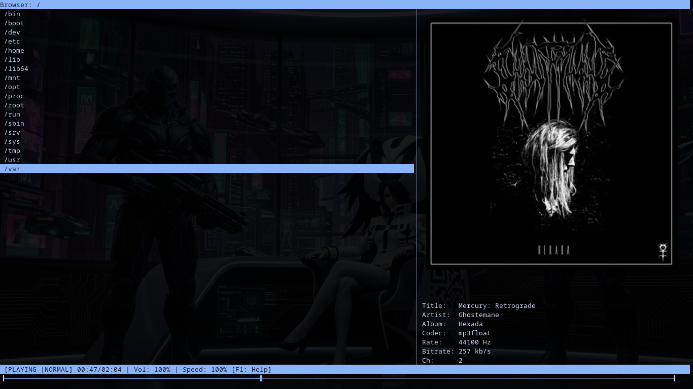

# Mothplayer
Fast tui/gui music player inspired by cmus with extra beautiful features

# Features
blazingly fast tui music player\
supported container format
- mp3
- flac
- m4a
- ogg
- wav

keys mapped (hotkeys for everything) F1 to print all\
Varispeed control
Reverse playing
vim mode :rename,del,seek,rev,vol,spd

## Metadata support

- Cover image (sixel/tui) (raw/x11)
- Title
- Artist
- Album
- Codec
- Rate
- Bitrate
- Channels

# BUILD

`make -j$(nproc)`

## Dependency

- ncurses
- ffmpeg
- libsixel
- alsa

# Screenshots

